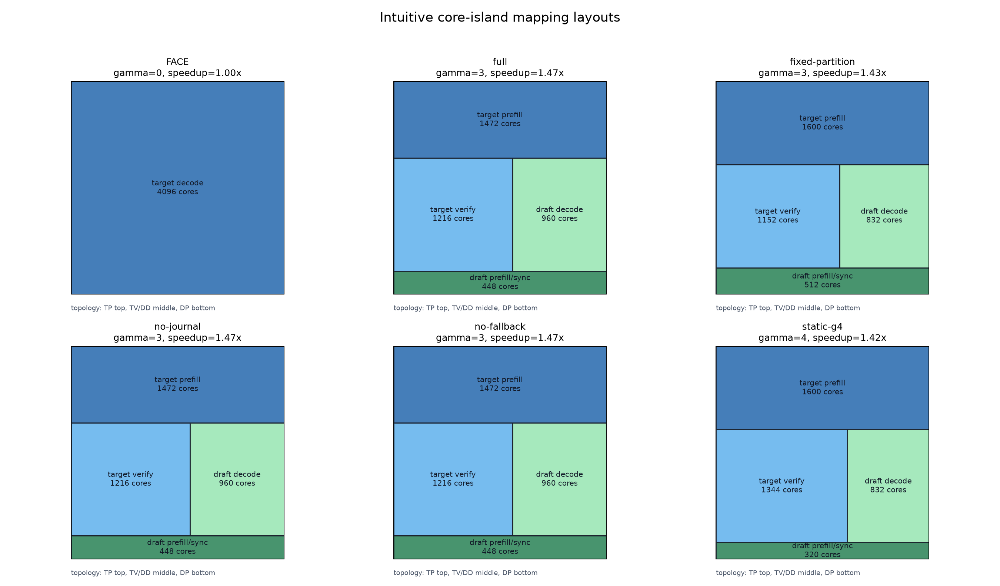
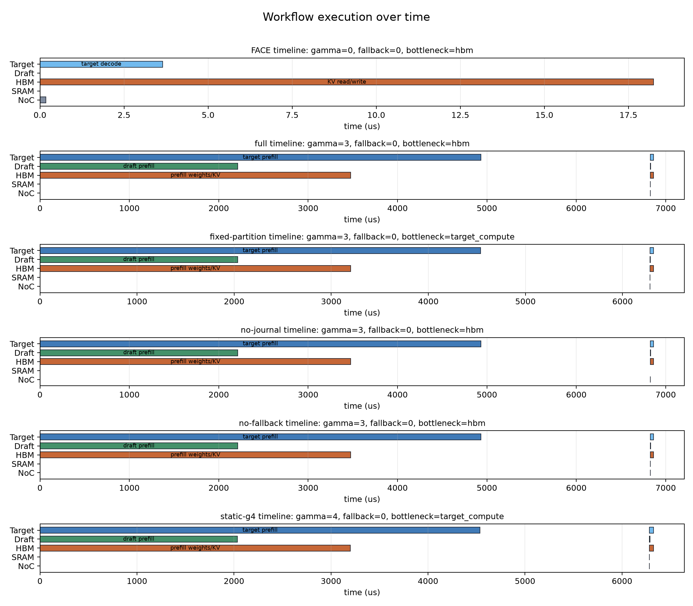
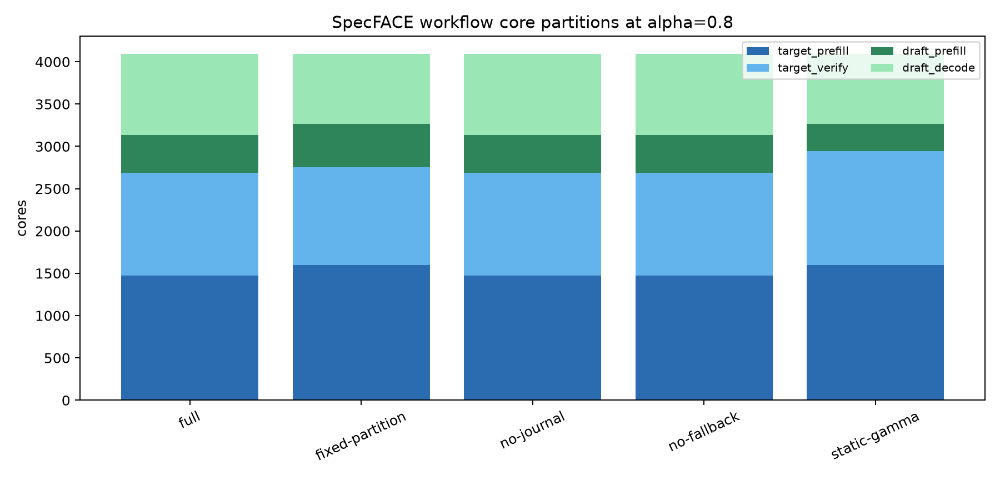
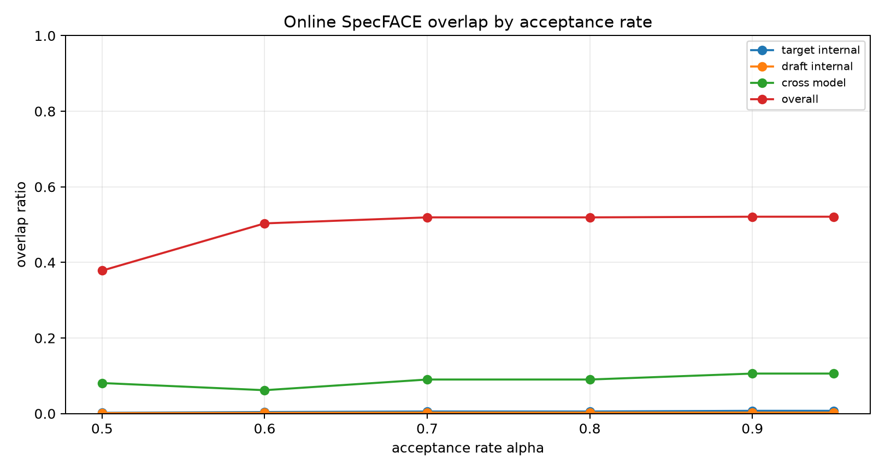
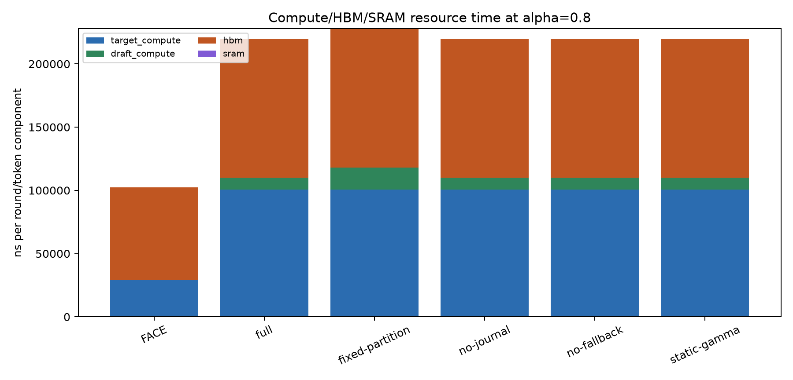
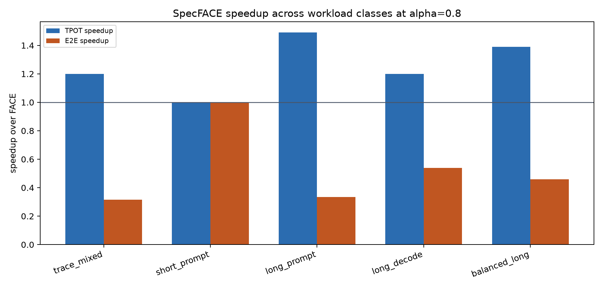

# SpecFACE Micro Experiment 001

This single-instance analytical experiment uses the lightweight OME search from `docs/images/SpecFACE_plan.md` and the FACE WSC baseline configuration. It now emits plots for workflow partitioning, online overlap, resource usage, and workload-class speedups.

Output directory: `/home/lbqy/astra-sim/examples/llm_serving/specface/outputs`
Plot directory: `/home/lbqy/astra-sim/docs/images/specface_experiment_001`

## Default-alpha Snapshot

Default acceptance rate: `0.8`

| mode | gamma | fallback | ns/token | speedup vs FACE | partition TP/TV/DP/DD | bottleneck |
|---|---:|---:|---:|---:|---|---|
| FACE | 0 | 0 | 18250.5 | 1.000 | 4096/0/0/0 | hbm |
| SpecFACE-fixed-partition | 3 | 0 | 12764.9 | 1.430 | 1600/1152/512/832 | target_compute |
| SpecFACE-full | 3 | 0 | 12422.5 | 1.469 | 1472/1216/448/960 | hbm |
| SpecFACE-no-fallback | 3 | 0 | 12422.5 | 1.469 | 1472/1216/448/960 | hbm |
| SpecFACE-no-journal | 3 | 0 | 12424.7 | 1.469 | 1472/1216/448/960 | hbm |
| SpecFACE-static-gamma | 1 | 0 | 15221.6 | 1.199 | 1280/960/576/1280 | hbm |
| SpecFACE-static-gamma | 2 | 0 | 13130.5 | 1.390 | 1280/960/576/1280 | hbm |
| SpecFACE-static-gamma | 4 | 0 | 12811.2 | 1.425 | 1600/1344/320/832 | target_compute |
| SpecFACE-static-gamma | 8 | 1 | 18250.5 | 1.000 | 1280/960/576/1280 | target_compute |
| SpecFACE-static-gamma | 12 | 1 | 18250.5 | 1.000 | 1280/960/576/1280 | target_compute |
| SpecFACE-static-gamma | 16 | 1 | 18250.5 | 1.000 | 1280/960/576/1280 | target_compute |

## Figures

### Workflow Mapping Layouts

### Workflow Timelines

### Workflow Partitions

### Online Overlap

### Resource Breakdown

### Workload Speedup

## Workload-Class Speedups

| workload | prompt | output | context | gamma | fallback | TPOT speedup | E2E speedup | bottleneck |
|---|---:|---:|---:|---:|---:|---:|---:|---|
| trace_mixed | 747 | 41 | 747 | 3 | 0 | 1.469 | 0.442 | hbm |
| short_prompt | 256 | 64 | 256 | 1 | 0 | 1.072 | 0.499 | target_compute |
| long_prompt | 2048 | 64 | 2048 | 4 | 0 | 1.491 | 0.420 | hbm |
| long_decode | 512 | 256 | 512 | 2 | 0 | 1.388 | 0.758 | hbm |
| balanced_long | 1024 | 128 | 1024 | 4 | 0 | 1.488 | 0.517 | hbm |

## Notes

At alpha=0.8, the best full SpecFACE point selects gamma=3 and estimates 1.469x speedup over FACE decode ns/token. Journal peak is 1.57 MB against 252.00 MB available in the draft decode island.
These numbers are not cycle-accurate; they are meant to drive the first microarchitecture sweep and identify useful regions for the simulator implementation.
